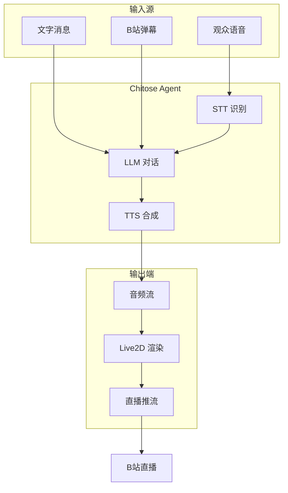

# Chitose 项目全面解析 🌸

> **生成日期**: 2026-02-03  
> **版本**: v0.1 MVP  
> **项目类型**: AI 虚拟主播系统

---

## 一、项目概述

### 1.1 项目定位

**Chitose（千岁）** 是一个基于 LiveKit Agents 构建的**低延迟 AI 虚拟主播系统**，旨在实现一个能够与观众实时互动的 AI VTuber。

### 1.2 核心特性

| 特性 | 说明 |
|------|------|
| ⚡ **超低延迟** | 基于 LiveKit Agents 框架，端到端延迟 <500ms |
| 🔌 **模块可插拔** | LLM、TTS、STT、形象渲染各模块独立，易于替换 |
| 🎯 **MVP 优先** | 采用最小可行产品策略，快速验证核心功能 |
| 🌏 **多语言支持** | 支持中文和多语言语音识别与合成 |
| 🎭 **虚拟形象** | 集成 Live2D 模型渲染，支持口型同步 |

### 1.3 应用场景

- **直播互动**: 作为 AI 虚拟主播在 Bilibili 等平台进行直播
- **语音对话**: 通过语音或文字与观众实时互动
- **虚拟偶像**: 展示 Live2D 虚拟形象，提供视觉体验
- **娱乐直播**: 结合弹幕互动，实现自动化直播

---

## 二、技术架构

### 2.1 整体架构图

```
┌─────────────────────────────────────────────────────────────┐
│                       Chitose System                        │
├─────────────────────────────────────────────────────────────┤
│                                                             │
│  ┌──────────────┐     ┌──────────────┐     ┌────────────┐ │
│  │   输入层      │────▶│   处理层      │────▶│   输出层    │ │
│  │              │     │              │     │            │ │
│  │ • 语音 (STT) │     │ • LLM 对话   │     │ • TTS 合成 │ │
│  │ • 文字       │     │ • Agent 逻辑 │     │ • 音频流   │ │
│  │ • 弹幕(计划) │     │ • VAD 检测   │     │ • Live2D   │ │
│  └──────────────┘     └──────────────┘     └────────────┘ │
│                                                             │
└─────────────────────────────────────────────────────────────┘
         ↑                                          ↓
         │                                          │
    ┌────┴─────┐                            ┌──────┴──────┐
    │ LiveKit  │                            │   网页展示   │
    │ Room/RTC │                            │ (Live2D UI) │
    └──────────┘                            └─────────────┘
```

### 2.2 核心模块

#### 2.2.1 实时通信层 (LiveKit)
- **框架**: LiveKit Agents SDK
- **功能**: 提供低延迟的实时音视频通信能力
- **优势**: 内置 VAD、流式处理、房间管理

#### 2.2.2 AI 对话模块 (LLM)
- **当前方案**: OpenAI Compatible API
- **支持模型**: GPT-4o-mini, Gemini 等兼容 API
- **配置**: 支持自定义 base_url、model、temperature
- **人设**: 通过 system_prompt 定义虚拟主播的性格特点

#### 2.2.3 语音合成模块 (TTS)
- **当前方案**: ElevenLabs
- **模型**: `eleven_multilingual_v2` / `eleven_turbo_v2_5`
- **特性**: 支持多语言、流式输出、自然语音
- **配置**: 可自定义 voice_id 选择不同声音

#### 2.2.4 语音识别模块 (STT)
- **当前方案**: Deepgram Nova-3
- **语言**: 多语言自动检测 (`language="multi"`)
- **已知问题**: 中文识别准确率有待提升
- **备选方案**: OpenAI Whisper、阿里 FunASR

#### 2.2.5 语音活动检测 (VAD)
- **方案**: Silero VAD
- **功能**: 检测用户何时开始/停止说话
- **集成**: LiveKit 内置插件

#### 2.2.6 虚拟形象渲染 (Live2D)
- **技术栈**: PixiJS 7.4.2 + pixi-live2d-display 0.4.0
- **模型**: Cubism 4 SDK (芊芊模型)
- **功能**: 
  - 模型渲染与动画播放
  - 口型同步 API (`setMouthOpenY`)
  - 交互控制 (拖动、缩放)
- **背景**: 透明背景，便于 OBS/Spout2 采集

---

## 三、项目结构详解

### 3.1 目录结构

```
Chitose/
├── chitose/                    # 核心代码包
│   ├── __init__.py            # 包初始化
│   ├── agent.py               # Agent 核心逻辑
│   ├── config.py              # 配置管理系统
│   └── utils.py               # 工具函数
│
├── config/                     # 配置文件
│   └── default.yaml           # 默认配置
│
├── docs/                       # 文档
│   ├── TECHNICAL_REVIEW.md    # 技术方案评审
│   ├── DEV_LOG.md             # 开发日志
│   ├── TODO.md                # 待办事项
│   └── PROJECT_UNDERSTANDING.md # 项目理解文档
│
├── web/                        # Live2D 网页
│   ├── index.html             # 入口页面
│   ├── app.js                 # Live2D 渲染逻辑
│   ├── lib/                   # 第三方库
│   └── README.md              # 网页使用说明
│
├── test_tts.py                 # TTS 测试脚本
├── test_deepgram.py            # STT 测试脚本
├── main.py                     # 程序入口
├── pyproject.toml              # 项目配置与依赖
├── .env.example                # 环境变量模板
└── README.md                   # 项目说明
```

### 3.2 核心文件说明

#### 3.2.1 `main.py` - 程序入口
```python
# 职责：
# 1. 加载环境变量和配置
# 2. 初始化 LiveKit Agent
# 3. 配置 LLM、TTS、STT、VAD
# 4. 启动 Agent Session
# 5. 连接到 LiveKit Room
```

**关键代码流程**:
1. `load_dotenv()` - 加载 .env 环境变量
2. `ChitoseConfig.load()` - 加载 YAML 配置
3. `AgentSession()` - 创建会话（配置所有插件）
4. `session.start()` - 启动 Agent 并连接房间

#### 3.2.2 `chitose/agent.py` - Agent 核心
```python
# ChitoseAgent 类：
# - 继承自 livekit.agents.Agent
# - 定义虚拟主播的行为逻辑
# - 处理用户交互和对话流程
```

**核心方法**:
- `on_enter()`: Agent 激活时发送欢迎语
- `on_exit()`: Agent 退出时的清理工作
- `on_user_turn_completed()`: 用户发言后的回调

#### 3.2.3 `chitose/config.py` - 配置管理
```python
# 三层配置系统：
# 1. 代码默认值 (dataclass 定义)
# 2. YAML 配置文件 (config/default.yaml)
# 3. 环境变量 (.env) - 优先级最高
```

**配置类**:
- `LiveKitConfig`: LiveKit 连接配置
- `AgentConfig`: Agent 行为配置 (LLM、TTS、人设等)
- `ChitoseConfig`: 总配置容器

#### 3.2.4 `chitose/utils.py` - 工具函数
- `setup_logging()`: 日志配置
- `truncate_text()`: 文本截断工具

#### 3.2.5 `web/app.js` - Live2D 渲染
```javascript
// 功能：
// 1. 初始化 PixiJS 应用
// 2. 加载 Live2D 模型
// 3. 模型居中与缩放
// 4. 交互控制 (拖动、缩放)
// 5. 口型同步 API
```

**核心 API**:
- `window.setMouthOpenY(value)`: 控制嘴巴张开程度 (0~1)

---

## 四、技术选型分析

### 4.1 为什么选择 LiveKit Agents？

| 优势 | 说明 |
|------|------|
| **低延迟** | WebRTC 实时通信，端到端延迟 <500ms |
| **开箱即用** | 内置 VAD、流式 TTS、会话管理 |
| **插件生态** | 官方支持 OpenAI、ElevenLabs、Deepgram 等 |
| **易于扩展** | 模块化设计，便于替换各个组件 |
| **生产就绪** | 云服务 + 自托管两种部署方式 |

### 4.2 各模块技术选型对比

#### LLM (大语言模型)
| 方案 | 优势 | 劣势 | 选择原因 |
|------|------|------|---------|
| OpenAI API | 质量高、稳定 | 需要代理、成本高 | 兼容性强，易切换 |
| Gemini API | 免费额度大 | 国内访问难 | 成本低、性能好 |
| 本地 LLM | 无成本、隐私 | 性能差、延迟高 | - |

**当前方案**: OpenAI Compatible API (支持 base_url 配置)

#### TTS (语音合成)
| 方案 | 优势 | 劣势 | 选择原因 |
|------|------|------|---------|
| ElevenLabs | 音质最佳、自然度高 | 成本较高 | ✅ 当前使用 |
| Azure TTS | 稳定、多语言 | 音质一般 | 备选 |
| Edge TTS | 完全免费 | 限制多、不稳定 | 测试用 |

**当前方案**: ElevenLabs `eleven_multilingual_v2`

#### STT (语音识别)
| 方案 | 优势 | 劣势 | 选择原因 |
|------|------|------|---------|
| Deepgram | 低延迟、流式识别 | 中文识别较差 | ✅ 当前使用 |
| OpenAI Whisper | 准确率高 | 延迟较高 | 备选 |
| 阿里 FunASR | 中文准确率高 | 需自部署 | 待评估 |

**当前方案**: Deepgram Nova-3 (多语言)  
**已知问题**: 中文识别准确率待提升

#### Live2D 渲染
| 方案 | 优势 | 劣势 | 选择原因 |
|------|------|------|---------|
| pixi-live2d-display | 轻量、易集成 | 需手动下载 SDK | ✅ 当前使用 |
| 官方 SDK | 功能完整 | 集成复杂 | - |
| VTube Studio API | 专业、功能强 | 需额外软件 | 备选 |

**当前方案**: pixi-live2d-display + PixiJS 7

---

## 五、配置与环境

### 5.1 环境变量 (.env)

```bash
# LiveKit 连接
LIVEKIT_URL=wss://your-project.livekit.cloud
LIVEKIT_API_KEY=your-api-key
LIVEKIT_API_SECRET=your-api-secret

# LLM (OpenAI Compatible)
OPENAI_API_KEY=your-openai-api-key
LLM_MODEL=gpt-4o-mini
OPENAI_BASE_URL=https://api.openai.com/v1  # 可选

# TTS (ElevenLabs)
ELEVENLABS_API_KEY=your-elevenlabs-api-key
ELEVENLABS_VOICE_ID=your-voice-id
ELEVENLABS_MODEL=eleven_turbo_v2_5  # 可选

# STT (Deepgram)
DEEPGRAM_API_KEY=your-deepgram-api-key
```

### 5.2 YAML 配置 (config/default.yaml)

```yaml
agent:
  # LLM 设置
  llm_model: gpt-4o-mini
  llm_base_url: null
  temperature: 0.7
  
  # TTS 设置
  tts_voice: "EXAVITQu4vr4xnSDxMaL"
  tts_model: eleven_turbo_v2_5
  
  # 人设
  system_prompt: |
    你是 Chitose（千岁），一个 AI 虚拟主播。
    性格活泼可爱，喜欢和观众互动。
    回复简洁自然，控制在 50 字以内。
  
  greeting: "大家好，我是千岁~ 今天也请多多关照喵！"
```

### 5.3 Python 依赖

```toml
[project]
dependencies = [
    "livekit-agents>=1.0.0",           # 核心框架
    "livekit-plugins-openai>=1.0.0",    # LLM 插件
    "livekit-plugins-elevenlabs>=1.0.0", # TTS 插件
    "livekit-plugins-silero>=1.0.0",    # VAD 插件
    "pyyaml>=6.0",                      # YAML 解析
    "python-dotenv>=1.0.0",             # 环境变量
]
```

---

## 六、运行与使用

### 6.1 环境准备

```bash
# 1. 创建虚拟环境
conda create -n Chitose_env python=3.10
conda activate Chitose_env

# 2. 安装依赖
pip install -e .

# 3. 配置环境变量
cp .env.example .env
vim .env  # 填入各个 API 密钥
```

### 6.2 运行方式

#### 方式 1: 开发模式
```bash
# 启动本地开发服务器
python main.py dev

# 访问 LiveKit Playground 测试
# URL: https://agents-playground.livekit.io/
```

#### 方式 2: 连接模式
```bash
# 连接到已有 LiveKit Room
python main.py connect
```

### 6.3 Live2D 网页展示

```bash
# 1. 下载 Cubism Core SDK
# 从 Live2D 官网下载，放到 web/lib/

# 2. 启动本地服务器
cd web
python -m http.server 8080

# 3. 浏览器访问
# http://localhost:8080
```

### 6.4 测试脚本

```bash
# 测试 TTS (ElevenLabs)
python test_tts.py

# 测试 STT (Deepgram)
python test_deepgram.py
```

---

## 七、开发路线

### 7.1 MVP (当前阶段) ✅

**目标**: 验证核心语音对话管道

- [x] LiveKit Agents 框架集成
- [x] LLM 对话功能 (OpenAI Compatible)
- [x] TTS 语音合成 (ElevenLabs)
- [x] STT 语音识别 (Deepgram)
- [x] 文字输入支持
- [x] Live2D 模型渲染
- [x] 配置管理系统

### 7.2 Phase 1: 直播基础功能

- [ ] Bilibili 弹幕输入集成 (blivedm)
- [ ] RTMP 推流到直播平台
- [ ] 音频混流与输出
- [ ] STT 中文识别优化 (切换到 Whisper/FunASR)

### 7.3 Phase 2: 高级功能

- [ ] Live2D 口型同步 (基于音频分析)
- [ ] 表情动作触发
- [ ] Spout2 画面共享 (Windows)
- [ ] OBS 直播流集成

### 7.4 Phase 3: 自动化与优化

- [ ] 定时任务 / 弹幕触发
- [ ] 多人互动场景
- [ ] 性能优化与监控
- [ ] 日志持久化与告警

---

## 八、工作流程与数据流

### 8.1 完整直播工作流 (规划)



### 8.2 当前 MVP 数据流

```
用户输入 (语音/文字)
    ↓
LiveKit Room
    ↓
STT (Deepgram) 识别为文字
    ↓
LLM (OpenAI) 生成回复
    ↓
TTS (ElevenLabs) 合成语音
    ↓
LiveKit Room 音频流
    ↓
用户收听
```

### 8.3 Live2D 渲染流程

```
网页加载
    ↓
加载 Cubism Core SDK
    ↓
初始化 PixiJS 应用
    ↓
加载 Live2D 模型 (JSON)
    ↓
模型居中 & 缩放
    ↓
启用交互 (拖动、缩放)
    ↓
提供口型同步 API (setMouthOpenY)
    ↓
渲染循环 (PixiJS Ticker)
```

---

## 九、关键技术细节

### 9.1 AgentSession 初始化

**正确写法** (LiveKit Agents v1.x):
```python
from livekit.plugins import openai, elevenlabs, silero, deepgram

session = AgentSession(
    llm=openai.LLM(model="gpt-4o-mini", temperature=0.7),
    tts=elevenlabs.TTS(voice="voice-id", model="eleven_turbo_v2_5"),
    stt=deepgram.STT(language="multi"),
    vad=silero.VAD.load(),
)
```

**错误写法** (已过时):
```python
# ❌ 不要使用字符串指定插件
session = AgentSession(
    llm="openai/gpt-4o-mini",  # 错误
    tts="elevenlabs/voice-id", # 错误
)
```

### 9.2 配置优先级

```
环境变量 (.env) > YAML 配置 > 代码默认值
```

示例：
1. 代码默认值: `llm_model = "gpt-4o-mini"`
2. YAML 覆盖: `llm_model: gpt-3.5-turbo`
3. 环境变量覆盖: `LLM_MODEL=gpt-4`

最终生效: `gpt-4`

### 9.3 Live2D 口型同步

```javascript
// 音频数据 → 音量分析 → 嘴巴开合度
function syncMouth(audioData) {
    const volume = calculateVolume(audioData);
    const mouthOpen = volume * 0.8; // 0~1
    window.setMouthOpenY(mouthOpen);
}
```

**实现路径**:
1. LiveKit 接收 TTS 音频流
2. 网页播放音频并分析音量
3. 实时调用 `setMouthOpenY()` 更新模型

---

## 十、已知问题与优化方向

### 10.1 高优先级问题

#### 问题 1: Deepgram 中文识别不佳
- **现象**: 中文语音识别准确率低
- **影响**: 影响中文用户交互体验
- **解决方案**:
  - 切换到 OpenAI Whisper API
  - 或部署阿里 FunASR
  - 或自建 Whisper 模型

#### 问题 2: 缺少口型同步
- **现象**: Live2D 模型无法根据语音同步嘴型
- **影响**: 视觉体验不自然
- **解决方案**:
  - 在网页中集成音频分析
  - 基于音量或音素调用 `setMouthOpenY()`

### 10.2 中优先级优化

- [ ] 接入 Bilibili 弹幕作为文字输入
- [ ] RTMP 推流到直播平台
- [ ] 音频混流处理
- [ ] 表情动作触发系统

### 10.3 低优先级优化

- [ ] 配置热更新 (无需重启)
- [ ] 日志持久化与归档
- [ ] 性能监控与告警
- [ ] 多房间并发支持

---

## 十一、依赖服务

### 11.1 必需服务

| 服务 | 用途 | 获取方式 |
|------|------|---------|
| **LiveKit Cloud** | 实时通信 | https://cloud.livekit.io/ |
| **OpenAI API** | LLM 对话 | https://platform.openai.com/ |
| **ElevenLabs** | TTS 语音合成 | https://elevenlabs.io/ |
| **Deepgram** | STT 语音识别 | https://developers.deepgram.com/ |

### 11.2 可选服务

| 服务 | 用途 | 获取方式 |
|------|------|---------|
| **Gemini API** | 替代 OpenAI LLM | https://ai.google.dev/ |
| **Azure TTS** | 替代 ElevenLabs | https://azure.microsoft.com/ |
| **Bilibili API** | 弹幕接入 | - |

### 11.3 成本估算

**月度成本** (假设每天直播 2 小时):
- LiveKit: $0 ~ $50 (根据用量)
- OpenAI API: $20 ~ $50 (根据对话次数)
- ElevenLabs: $22 (Creator Plan)
- Deepgram: $0 ~ $25 (根据识别时长)

**总计**: $42 ~ $147 / 月

---

## 十二、开发与贡献

### 12.1 开发环境

- **Python**: 3.10+
- **操作系统**: Windows / macOS / Linux
- **IDE**: VSCode / PyCharm

### 12.2 代码风格

- 遵循 PEP 8 规范
- 使用 type hints
- 文档字符串 (docstring)

### 12.3 提交规范

```bash
# 功能开发
git commit -m "feat: 添加 Bilibili 弹幕支持"

# Bug 修复
git commit -m "fix: 修复 Deepgram 中文识别问题"

# 文档更新
git commit -m "docs: 更新 README"
```

---

## 十三、参考资料

### 13.1 官方文档

- [LiveKit Agents 文档](https://docs.livekit.io/agents/)
- [LiveKit Python SDK](https://github.com/livekit/python-sdk)
- [OpenAI API 文档](https://platform.openai.com/docs)
- [ElevenLabs API 文档](https://elevenlabs.io/docs)
- [Deepgram API 文档](https://developers.deepgram.com/)

### 13.2 第三方库

- [pixi-live2d-display](https://github.com/guansss/pixi-live2d-display)
- [PixiJS](https://pixijs.com/)
- [blivedm - B站弹幕库](https://github.com/xfgryujk/blivedm)

### 13.3 相关项目

- [LiveKit Agent Examples](https://github.com/livekit/agents)
- [VTube Studio](https://denchisoft.com/)

---

## 十四、常见问题 (FAQ)

### Q1: 如何更换 LLM 模型？

**A**: 修改 `.env` 或 `config/default.yaml`:
```bash
# .env
LLM_MODEL=gpt-3.5-turbo
```

### Q2: 如何自定义虚拟主播性格？

**A**: 编辑 `config/default.yaml` 中的 `system_prompt`:
```yaml
agent:
  system_prompt: |
    你是一个温柔的大姐姐，喜欢照顾别人...
```

### Q3: 如何部署到服务器？

**A**: 使用 `python main.py connect` 模式，无需本地界面。

### Q4: 如何接入 Bilibili 弹幕？

**A**: 使用 `blivedm` 库，在 Phase 1 开发中。

### Q5: Live2D 模型在哪里获取？

**A**: 
- 官方示例: https://www.live2d.com/en/download/sample-data/
- 第三方: https://github.com/topics/live2d-models

### Q6: 如何降低 API 成本？

**A**:
- LLM: 使用 Gemini API (免费额度大)
- TTS: 使用 Edge TTS (完全免费)
- STT: 减少语音识别时长

---

## 十五、项目状态

### 15.1 当前版本
- **版本**: v0.1.0 (MVP)
- **状态**: 开发中
- **许可证**: MIT

### 15.2 功能完成度

| 模块 | 状态 | 完成度 |
|------|------|--------|
| 核心框架 | ✅ 完成 | 100% |
| LLM 对话 | ✅ 完成 | 100% |
| TTS 合成 | ✅ 完成 | 100% |
| STT 识别 | ⚠️ 待优化 | 70% |
| Live2D 渲染 | ✅ 完成 | 90% |
| 弹幕输入 | ❌ 未开始 | 0% |
| RTMP 推流 | ❌ 未开始 | 0% |
| 口型同步 | ❌ 未开始 | 0% |

### 15.3 测试覆盖
- 单元测试: 未实施
- 集成测试: 手动测试
- 端到端测试: 本地验证

---

## 十六、总结

### 16.1 项目亮点

1. **技术先进**: 采用 LiveKit Agents 最新框架，低延迟实时通信
2. **模块化设计**: 各组件独立可替换，便于迭代优化
3. **MVP 策略**: 快速验证核心功能，避免过度设计
4. **完整文档**: 详尽的技术文档和使用说明

### 16.2 适用人群

- AI 虚拟主播开发者
- LiveKit Agents 学习者
- VTuber 技术爱好者
- 实时语音对话系统开发者

### 16.3 下一步建议

1. **优化 STT**: 解决中文识别问题（切换到 Whisper）
2. **完善 Live2D**: 实现音频驱动的口型同步
3. **接入弹幕**: 集成 Bilibili 弹幕输入
4. **推流集成**: 支持 RTMP 推流到直播平台

---

## 附录

### A. 环境变量完整列表

```bash
# LiveKit
LIVEKIT_URL              # LiveKit 服务器地址
LIVEKIT_API_KEY          # API 密钥
LIVEKIT_API_SECRET       # API 密钥

# LLM
OPENAI_API_KEY           # OpenAI API 密钥
OPENAI_BASE_URL          # 可选：自定义 API 地址
LLM_MODEL                # 可选：模型名称
LLM_TEMPERATURE          # 可选：温度参数

# TTS
ELEVENLABS_API_KEY       # ElevenLabs API 密钥
ELEVENLABS_VOICE_ID      # Voice ID
ELEVENLABS_MODEL         # 可选：TTS 模型

# STT
DEEPGRAM_API_KEY         # Deepgram API 密钥
```

### B. 快速故障排查

| 问题 | 可能原因 | 解决方案 |
|------|---------|---------|
| 无法连接 LiveKit | API Key 错误 | 检查 .env 配置 |
| TTS 无声音 | ElevenLabs 配额用完 | 检查账户余额 |
| STT 识别不准 | 使用 Deepgram | 切换到 Whisper |
| Live2D 无法显示 | 缺少 Core SDK | 下载 live2dcubismcore.min.js |
| 模型加载失败 | 路径错误 | 检查 models/ 目录 |

---

**最后更新**: 2026-02-03  
**维护者**: GAIVR  
**联系方式**: 通过 GitHub Issues 反馈问题
