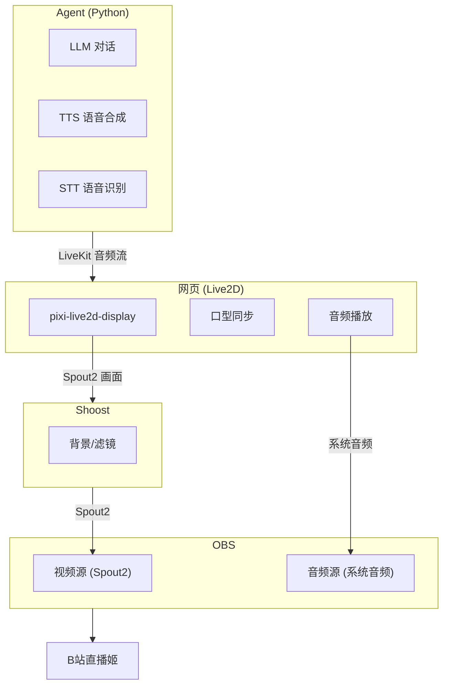

# Chitose 技术方案评审

> **日期**：2026-02-03  
> **版本**：v0.1 MVP

---

## 一、方案优势

| 方面 | 评价 |
|------|------|
| **LiveKit 选型** | 正确 - 低延迟（<500ms）、内置 VAD、流式 TTS 都是真实优势 |
| **模块化设计** | 合理 - 输入/输出/形象分离，便于后续扩展 |
| **双模式运行** | 实用 - 本地调试 + 服务器无头部署 |

---

## 二、API 更新说明

### 2.1 AgentSession 初始化方式

**原企划书写法**（已过时）：
```python
session = AgentSession(
    llm="openai/gpt-4.1-mini",
    tts="cartesia/sonic-3:xxxxxx",
    ...
)
```

**最新写法** - 直接使用插件类：
```python
from livekit.plugins import openai, elevenlabs, silero

session = AgentSession(
    llm=openai.LLM(model="gpt-4o-mini", temperature=0.7),
    tts=elevenlabs.TTS(voice="voice-id", model="eleven_turbo_v2_5"),
    vad=silero.VAD.load(),
)
```

### 2.2 Text Input 处理

原企划书中的 `room_io.TextInputEvent` 和 `room_io.TextInputOptions` 可能已变更。

**推荐方式**：
- 使用 **Room Data Message** (`publish_data` / `on_data_received`)
- 或直接在 Agent 中调用 `session.generate_reply(user_input=text)`

---

## 三、MVP 简化方案

### 3.1 功能裁剪

| 模块 | 完整方案 | MVP 简化方案 | 原因 |
|------|---------|-------------|------|
| **弹幕输入** | blivedm + LiveKit | 终端输入 | 先验证核心管道 |
| **形象渲染** | Live2D + pixi | 暂时跳过 | 语音优先 |
| **输出** | RTMP 推流 | 本地音频输出 | 快速验证 |
| **部署模式** | 本地 + 无头 | 仅本地 | 减少复杂度 |

### 3.2 MVP 项目结构

```
chitose/
├── chitose/
│   ├── __init__.py
│   ├── agent.py          # LiveKit Agent 定义
│   ├── config.py         # 配置加载
│   └── utils.py          # 工具函数
│
├── config/
│   └── default.yaml      # 默认配置
│
├── main.py               # 入口
├── pyproject.toml
└── README.md
```

> **说明**：`adapters/`、`output/`、`web/` 等目录在 MVP 验证后再添加。

### 3.3 MVP 技术栈

| 模块 | 选择 | 备注 |
|------|------|------|
| **实时通信** | LiveKit Agents | 核心框架 |
| **LLM** | OpenAI Compatible API | 通过 `openai.LLM` + `base_url` |
| **TTS** | ElevenLabs | `eleven_turbo_v2_5` 模型 |
| **VAD** | Silero | LiveKit 内置插件 |
| **STT** | Deepgram / OpenAI Whisper | 可选，MVP 可先用文字输入 |
| **输入** | 终端文字 | MVP 阶段 |
| **输出** | 本地音频 | MVP 阶段 |

---

## 四、依赖清单

### 4.1 Python 包

```toml
[project]
dependencies = [
    "livekit-agents>=1.0.0",
    "livekit-plugins-openai>=1.0.0",
    "livekit-plugins-elevenlabs>=1.0.0",
    "livekit-plugins-silero>=1.0.0",
    "pyyaml>=6.0",
    "python-dotenv>=1.0.0",
]
```

### 4.2 环境变量

```bash
# .env
LIVEKIT_URL=wss://your-livekit-server.livekit.cloud
LIVEKIT_API_KEY=your-api-key
LIVEKIT_API_SECRET=your-api-secret

OPENAI_API_KEY=your-openai-key
OPENAI_BASE_URL=https://api.openai.com/v1  # 或其他兼容 API

ELEVENLABS_API_KEY=your-elevenlabs-key
```

---

## 五、直播工作流架构

### 5.1 完整工作流



### 5.2 画面流 vs 音频流

| 类型 | 路径 |
|------|------|
| **画面流** | 网页 (Live2D) → Spout2 → Shoost → Spout2 → OBS |
| **音频流** | Agent (TTS) → LiveKit → 网页播放 → 系统音频 → OBS |

> **说明**: 网页同时负责 Live2D 渲染和音频播放，音频用于口型同步并输出到系统音频供 OBS 采集。

### 5.3 技术选型

| 模块 | 选择 | 备注 |
|------|------|------|
| **Live2D 渲染** | pixi-live2d-display | PixiJS + Cubism 4 |
| **画面共享** | Spout2 | 零延迟 GPU 共享 |
| **音频传输** | LiveKit Client SDK | 网页接收音频 |
| **直播间合成** | Shoost | 背景/滤镜管理 |
| **推流** | OBS + B站直播姬 | |

---

## 六、后续扩展路线

```
MVP (当前) ✅ LLM + TTS + STT 管道
   │
   ├─► Phase 1: Live2D 皮套
   │     └── pixi-live2d-display + Spout2
   │
   ├─► Phase 2: B站弹幕输入
   │     └── blivedm 桥接
   │
   └─► Phase 3: 自动化
         └── 定时任务 / 弹幕触发
```

---

## 七、参考资料

- [LiveKit Agents 官方文档](https://docs.livekit.io/agents/)
- [LiveKit Python SDK](https://github.com/livekit/python-sdk)
- [ElevenLabs API](https://elevenlabs.io/docs)
- [Deepgram API](https://developers.deepgram.com/)
- [pixi-live2d-display](https://github.com/guansss/pixi-live2d-display)
- [Spout2](https://spout.zeal.co/)
- [blivedm - B站直播弹幕库](https://github.com/xfgryujk/blivedm)

